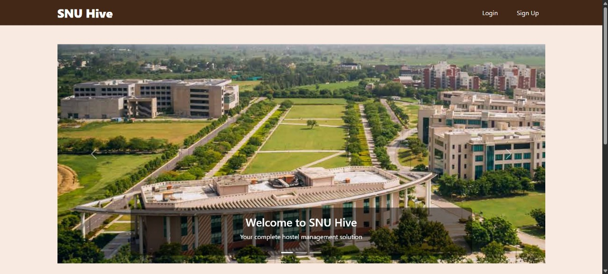
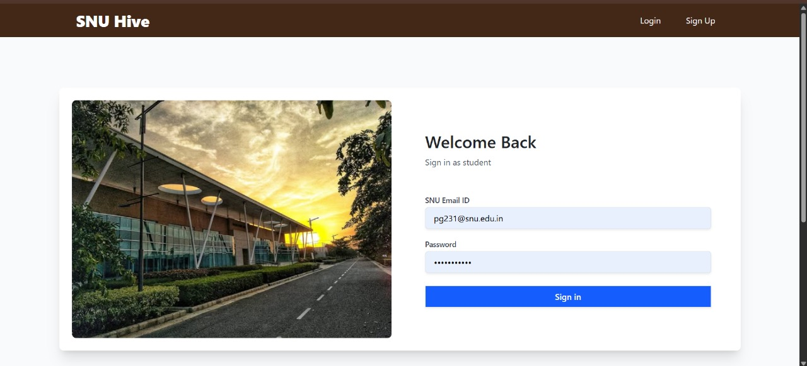
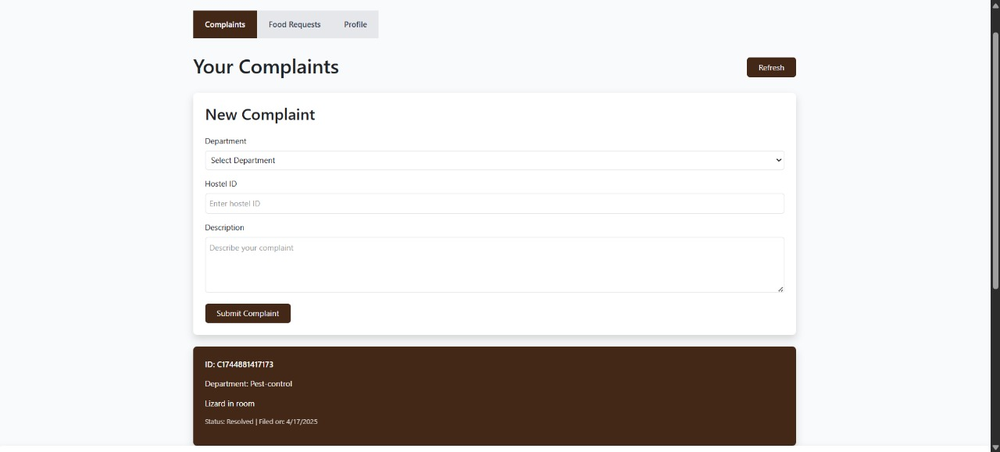

# SNUHive – Hostel Management System

SNUHive is a full-stack **Hostel Management System** designed for students, wardens, and administrators to **digitally manage food requests, complaints, and communications** across Shiv Nadar University's residential campuses.

Built to streamline everyday hostel operations, SNUHive fosters transparency and accountability in student-warden interactions.

---

##  Features

###  Student Portal
- Submit food requests
- File complaints (maintenance, hygiene, etc.)
- View complaint history and status
- Receive notifications from wardens

###  Warden Dashboard
- View and respond to complaints
- Approve/deny food requests
- Send broadcast messages to students
- Track response metrics

###  Admin Panel
- Manage users (students, wardens)
- Role-based access control
- Monitor system activity
- Maintain master database

---

##  Tech Stack

- **Frontend:** React.js, Tailwind CSS
- **Backend:** Node.js, Express.js
- **Database:** MySQL
- **Authentication:** Role-based login (JWT/session-based)
- **Deployment:** (add Heroku/Vercel/AWS if applicable)

---

##  Demo
## 📸 Screenshots

  
*Landing page of SNUHive*

  
*Signup flow for new users*


*complaints*


---

## 📦 Installation

```bash
git clone https://github.com/CipherEnigma/SNUHive.git
cd SNUHive
npm install
cd client
npm install

